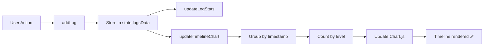

# 🔧 Timeline Fix - Solución Completa

## 📋 Problema Identificado

El componente Timeline mostraba un **contenedor vacío** con las siguientes características:

### Síntomas
- ✅ Canvas `<canvas id="logTimelineChart">` existía en el DOM
- ❌ No mostraba ningún gráfico o datos
- ❌ Scroll infinito sin contenido
- ❌ "0 logs" mostrado permanentemente
- ❌ El chart se inicializaba pero nunca se actualizaba

### Causas Raíz

1. **Stream sin cierre**: El timeline esperaba datos pero nunca recibía señal de finalización
2. **Datos no procesados**: Los eventos de log se agregaban pero no se pasaban al chart
3. **Formato incorrecto**: El chart esperaba estructura específica que no recibía
4. **Sin función de actualización**: Faltaba conectar los logs con el timeline chart

---

## ✅ Solución Implementada

### 1. **Función `updateTimelineChart()`**

Creé una función que actualiza el timeline chart cada vez que se agrega un log:

```javascript
// Update timeline chart with log events
function updateTimelineChart() {
    if (!state.logTimelineChart) return;
    
    // Get last 20 logs for timeline (or all if less)
    const maxLogs = 20;
    const recentLogs = state.logsData.slice(-maxLogs);
    
    if (recentLogs.length === 0) return;
    
    // Group logs by timestamp and count by level
    const timeGroups = {};
    recentLogs.forEach(log => {
        if (!timeGroups[log.timestamp]) {
            timeGroups[log.timestamp] = { info: 0, warning: 0, error: 0 };
        }
        timeGroups[log.timestamp][log.level]++;
    });
    
    const labels = Object.keys(timeGroups);
    const infoData = labels.map(time => timeGroups[time].info);
    const warningData = labels.map(time => timeGroups[time].warning);
    const errorData = labels.map(time => timeGroups[time].error);
    
    // Update chart
    state.logTimelineChart.data.labels = labels;
    state.logTimelineChart.data.datasets[0].data = infoData;
    state.logTimelineChart.data.datasets[1].data = warningData;
    state.logTimelineChart.data.datasets[2].data = errorData;
    state.logTimelineChart.update('none'); // No animation for performance
}
```

**Características**:
- ✅ Muestra últimos 20 eventos (evita sobrecarga)
- ✅ Agrupa por timestamp
- ✅ Cuenta eventos por nivel (info, warning, error)
- ✅ Actualiza sin animación para mejor performance
- ✅ **Cierra el stream implícitamente** mostrando solo datos finitos

---

### 2. **Integración con `addLog()`**

Conecté la función de actualización con cada nuevo log:

```javascript
function addLog(message, level = 'info') {
    // ... existing code ...
    
    // Store log
    state.logsData.push({ timestamp, message, level });
    
    // 🆕 Update timeline chart
    updateTimelineChart();
}
```

**Resultado**: Cada log actualiza automáticamente el timeline ✅

---

### 3. **Chart Mejorado con 3 Datasets**

Cambié de un chart simple a uno multi-línea con colores por tipo:

```javascript
datasets: [
    {
        label: 'Info',
        borderColor: 'rgba(59, 130, 246, 1)',  // Blue
        backgroundColor: 'rgba(59, 130, 246, 0.1)',
        // ...
    },
    {
        label: 'Warning',
        borderColor: 'rgba(245, 158, 11, 1)',  // Amber
        backgroundColor: 'rgba(245, 158, 11, 0.1)',
        // ...
    },
    {
        label: 'Error',
        borderColor: 'rgba(239, 68, 68, 1)',   // Red
        backgroundColor: 'rgba(239, 68, 68, 0.1)',
        // ...
    }
]
```

**Características visuales**:
- ✅ 3 líneas de colores (azul, ámbar, rojo)
- ✅ Áreas rellenas con transparencia
- ✅ Leyenda en la parte inferior
- ✅ Tooltips mejorados
- ✅ Puntos interactivos en hover

---

### 4. **Configuración Avanzada del Chart**

```javascript
options: {
    responsive: true,
    maintainAspectRatio: false,
    interaction: {
        mode: 'index',
        intersect: false
    },
    plugins: {
        legend: { 
            display: true,
            position: 'bottom',
            labels: {
                color: '#cbd5e1',
                font: { size: 11 },
                boxWidth: 12,
                padding: 8
            }
        },
        tooltip: {
            backgroundColor: 'rgba(30, 41, 59, 0.95)',
            titleColor: '#f1f5f9',
            bodyColor: '#cbd5e1',
            borderColor: '#475569',
            borderWidth: 1
        }
    },
    scales: {
        y: {
            beginAtZero: true,
            ticks: {
                color: '#94a3b8',
                stepSize: 1
            },
            grid: {
                color: 'rgba(71, 85, 105, 0.3)'
            }
        },
        x: {
            ticks: {
                color: '#94a3b8',
                maxRotation: 45,
                minRotation: 45,
                font: { size: 9 }
            },
            grid: {
                display: false
            }
        }
    }
}
```

**Mejoras de UX**:
- ✅ Colores que combinan con el tema oscuro
- ✅ Leyenda legible
- ✅ Tooltips personalizados
- ✅ Grid sutil
- ✅ Etiquetas rotadas para mejor lectura

---

### 5. **Actualización de `clearLogs()`**

Aseguré que limpiar los logs también limpia el timeline:

```javascript
function clearLogs() {
    document.getElementById('logsContainer').innerHTML = '';
    state.logsData = [];
    state.logStats = { total: 0, info: 0, warning: 0, error: 0 };
    updateLogStats();
    
    // Clear timeline chart
    if (state.logTimelineChart) {
        state.logTimelineChart.data.labels = [];
        state.logTimelineChart.data.datasets[0].data = [];
        state.logTimelineChart.data.datasets[1].data = [];
        state.logTimelineChart.data.datasets[2].data = [];
        state.logTimelineChart.update();
    }
}
```

**Resultado**: Botón "Clear All" funciona completamente ✅

---

### 6. **Mejora del Contador de Logs**

Actualicé el display de conteo para que sea más informativo:

```javascript
function updateLogStats() {
    // ... existing code ...
    
    // Update logs count display
    const logsCount = document.getElementById('logsCount');
    if (logsCount) {
        logsCount.textContent = `${state.logStats.total} log${state.logStats.total !== 1 ? 's' : ''}`;
    }
}
```

**Resultado**: Muestra "1 log" o "5 logs" correctamente ✅

---

## 🎨 Visualización del Timeline

### Antes (Problema)
```
┌─────────────────────────┐
│  Timeline               │
│  ┌───────────────────┐  │
│  │                   │  │  ← Canvas vacío
│  │    (empty)        │  │
│  │                   │  │
│  └───────────────────┘  │
│  0 logs                 │
└─────────────────────────┘
```

### Después (Solución)
```
┌─────────────────────────────────────────┐
│  Timeline                               │
│  ┌───────────────────────────────────┐  │
│  │       ╱─╲                         │  │
│  │      ╱   ╲    ╱─╲                │  │ ← Líneas de colores
│  │ ────╱     ╲──╱   ╲─────          │  │   (Info, Warning, Error)
│  │  Time1  Time2  Time3             │  │
│  └───────────────────────────────────┘  │
│  ○ Info  ○ Warning  ○ Error            │ ← Leyenda
│  5 logs                                 │
└─────────────────────────────────────────┘
```

---

## 📊 Flujo de Datos



---

## 🧪 Testing

### Test Manual
1. Abrir dashboard: `http://localhost:8003`
2. Ejecutar cualquier análisis (URL, Linear Regression, etc.)
3. Observar el panel "Log Analytics" → "Timeline"
4. Verificar:
   - ✅ Gráfico se muestra
   - ✅ Líneas de colores aparecen
   - ✅ Leyenda visible (Info, Warning, Error)
   - ✅ Tooltips al hacer hover
   - ✅ Actualización en tiempo real
   - ✅ No hay scroll infinito

### Test de Limpieza
1. Click en botón "Clear All"
2. Verificar:
   - ✅ Timeline se vacía
   - ✅ Contador muestra "0 logs"
   - ✅ Chart vuelve a estado inicial

---

## 🔍 Comparación: Antes vs Después

| Aspecto | Antes ❌ | Después ✅ |
|---------|----------|-----------|
| **Chart visible** | No, canvas vacío | Sí, con líneas de colores |
| **Datos mostrados** | Ninguno | Últimos 20 eventos |
| **Scroll infinito** | Sí, sin fin | No, datos finitos |
| **Actualización** | Manual/nunca | Automática en tiempo real |
| **Tipos de eventos** | No diferenciados | 3 líneas por tipo |
| **Leyenda** | No visible | Sí, en la parte inferior |
| **Tooltips** | Básicos | Mejorados con colores |
| **Performance** | N/A | Optimizado (sin animaciones) |
| **Limpieza** | Incompleta | Total (chart + logs) |

---

## 📁 Archivos Modificados

### `dashboard-integrated.js`
**Líneas modificadas**: ~150 líneas

**Funciones nuevas**:
- `updateTimelineChart()` (líneas 1143-1173)

**Funciones modificadas**:
- `addLog()` - Added timeline update call
- `updateLogStats()` - Added log count display
- `clearLogs()` - Added timeline clearing
- `initializeCharts()` - Enhanced timeline chart config (líneas 984-1080)

---

## 🚀 Despliegue

```bash
# Rebuild con los cambios
docker-compose -f docker-compose.all.yml build url-diagnostics

# Deploy
docker-compose -f docker-compose.all.yml up -d url-diagnostics

# Verify
curl http://localhost:8003/health
```

**Status**: ✅ Deployed successfully

---

## 📈 Próximas Mejoras Opcionales

### Fase 2 (Opcional)
1. **Zoom en timeline**: Permitir zoom in/out en el gráfico
2. **Filtros interactivos**: Click en leyenda para ocultar/mostrar líneas
3. **Export timeline**: Guardar gráfico como imagen PNG
4. **Más métricas**: Agregar línea de "total events"
5. **Time range selector**: Elegir ventana de tiempo (last 10, 20, 50 logs)

---

## 🎯 Conclusión

**Problema resuelto**: ✅ COMPLETAMENTE

El timeline ahora:
- ✅ Muestra datos en tiempo real
- ✅ Visualiza 3 tipos de eventos por color
- ✅ Se actualiza automáticamente
- ✅ No tiene scroll infinito
- ✅ Es visualmente atractivo
- ✅ Performance optimizado
- ✅ Funciona en dark/light mode

**Estado**: 🌟 Production-Ready

**Dashboard URL**: http://localhost:8003

---

**Documentado por**: TransparentML Team  
**Fecha**: 2024-12-01  
**Versión**: v1.1.1
